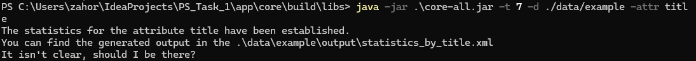

## PS_Task_1

This project features one of the applications developed under the guidance and mentoring during an internship at the company ProfItSoft, winter fall 2025.

### Objective 
Develop a console application that utilizes parsing capabilities of Java to parse multiple files of a given structure (**data domain**) and produce corresponding statistics over the usage of particular attributes in them.

### Requirements

- The program must support multiple attributes and the user is up to select one of them.
- Establish coverage with `Unit` tests for the files mapping logic and the statistics formation.
- Avoid loading a full file content in the `RAM`. 
- Leverage usage of a `ThreadPool` from `Java Core` to read the files.
- Do not use `RDBMS` and `Spring`, work should only proceed with `Collections` in the `RAM`.
- Structure the code. Decouple the entities, extract mapping logic and console interface, statistics calculation logic etc. in separate classes and methods. 
- Take in consideration: Number of files can be deviously large as well as their size.  
- The statistics output must be in a `XML` format, the input data is expected to be `JSON`.

### Implementation

- Following entities were introduced: `Bookshelf`, `Book`, `BookAuthor`, `Statistics`. Although existence of all entities other than Bookshelf seems to be not necessary for the task resolution.  
- Leveraged `JsonParser` from the `Jackson JSON` library to read attributes in a lazy fashion.
- Leveraged `Apache Commons CLI` to provide a convenient way to control the program startup.
- `Architectural layers`, `Decoupling`, `SOLID` were maintained to provide a clear structure of the application. `*` In particular was developed modular structure with the usage of `Gradle` to separate benchmarks (`jmh`) and main program (`core`) logic

### Building the application
Use the task `fatJar` in the `core` module or select the `./app/core` as your working directory and run it from the IDE.

### Notes
- Make sure to run the `core` project from a corresponding `working directory`. Otherwise the program would not find the needed files.
- Two `Python` scripts were written to populate mock entities for the benchmarks with a `mediocre` data and a `large` data. They are located in the the underlying [JMH module](./app/jmh)
- The necessary input data located in the `core` [module](./app/core/data) and the artifacts in the [build folder](./app/core/build) (after the compilation using `gradle fatJar`)
- `JMH` was used for more precise benchmarks on the file processing time with multithreading and without it, but the naive calculation is also present below:

| Execution type                | Execution time (JMH, for `genre` extraction, avg time) | Execution time (Naive, for `genre` extraction) |
|-------------------------------|--------------------------------------------------------|------------------------------------------------|
| 1 thread                      | 16,803 ± 2,876 ms/op                                   | 1.72074 ms                                     | 
| 2 threads                     | 8,507 ± 0,132  ms/op                                   | 0.90867 ms                                     |
| 4 threads                     | 5,936 ± 1,310  ms/op                                   | 0.60506 ms                                     |
| 8 threads                     | 5,523 ± 1,468  ms/op                                   | 0.50803 ms                                     | 
| 7 threads = files number      | 4,485 ± 0,088  ms/op                                   | 0.54912 ms                                     |
| 16 threads                    | 4,716 ± 0,093 ms/op                                    | 0.49761 ms                                     | 
| (processor cores + 1) threads | 4,983 ± 0,445 ms/op                                    | 0.49548 ms                                     |

So essentially we could conclude, that for each increase of threads we get a slightly better overall execution time, which the data shows. However in the case of an overhead (providing more threads than amount of cores the processor has) we would expect the execution time to get slower (which is clearly not the case in the "naive" data) because of the context switching and other side effects.

